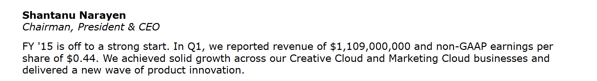

Clone this repository and run the code below to install all required packages


```python
#!pip install -r requirements.txt
```

# Anonymization of RAG inputs

This Python module is an implementation of anonymization tricks developed in the area of statistical disclosure control to facilitate **RAG Question-Answering tasks with sensitive attributes removed**.

## Proof of concept: Sentiment Analysis on Earnings Call data without metadata

An earnings call trascript typically contains a paragraph like this:



When training an LLM to predict sentiment scores on such data, we would like to get rid of all the infromation that enables the LLM to identify metadata such as company name, year and quarter. Otherwise, it is difficult to prevent it from using retrospectively available information to come up with the sentiment score.

To prevent this,Worlkflow Events called **AnonymizedRAGWorkflow** based on Llamaindex framework is built which consists of following steps:

1. Top-k similarity search between query and source transcript just like the naive RAG
2. Joint clustering of text chunks in the source file and other external files
3. **Swapping of sensitive attributes** between Top-k relevant text chunks from the source file and those of other external files belonging to the same cluster
4. Returning of original and anonymized text chunks as well as other useful objects for further processing

<a href="basic_workflow.html">Workflow Visualization</a>


### Demonstration


```python
import os
os.environ['OPENAI_API_KEY'] = ''
os.environ['NVIDIA_API_KEY'] = ''
from diff_match_patch import diff_match_patch
from AnonRAG import AnonymizedRAGWorkflow
```


```python
query = """
Assign two different sentiment scores described below about the next quarter. 
Scores must be ranging between 0 and 1, and the score 0.5 represent
neutral sentiment and the closer it gets to 0 the more negative it gets,
while the close it gets to 1, the more positive it gets.

Sentiment scores:

1. Mactoeconomic sentiments: how the company view overall health of the economy
in the next quarter. Words to look for are for example: Interest rates, Exchange rates,
GDP, Unemployment rate, Monetary Policy, etc.

2. Microeconomic sentiments: how the compant view the health of the firm-specific in the
next quarter. Words to look for are for example: Operating margning, Return of equity,
Debt-to-equity ratio, Sales growth, Inventory turnover, etc.
"""
```


```python
import nest_asyncio

nest_asyncio.apply()

w = AnonymizedRAGWorkflow(folder_name = 'EarningsCall',
                      file_name='ADBEQ1 2015.pdf',
                      openai_api_key = os.environ['OPENAI_API_KEY'],
                      nvidia_api_key= os.environ['NVIDIA_API_KEY'],
                      retrieval_query=query,
                      top_k = 10,timeout = None)
result = await w.run()
for ky in result['clustered_text_chunks']:
    anontxts = [anontxt['Anonymized_txt'].Anonymized_text for anontxt in result['clustered_text_chunks'][ky]]
    origtxts = [result['index'].docstore.docs.get(chunk['Id']).get_content() for chunk in result['clustered_text_chunks'][ky]]
    for idx in range(len(anontxts)):
        dmp = diff_match_patch()
        patches = dmp.patch_make(origtxts[idx],anontxts[idx])
        diff_txt = dmp.patch_toText(patches)
        print('Original Text:')
        print(origtxts[idx])
        print('Anonymized Text:')
        print(anontxts[idx])
        print('Difference')
        print(diff_txt)
```

    Carry out the retrieval using the following query:
    
    
    Assign two different sentiment scores described below about the next quarter. 
    Scores must be ranging between 0 and 1, and the score 0.5 represent
    neutral sentiment and the closer it gets to 0 the more negative it gets,
    while the close it gets to 1, the more positive it gets.
    
    Sentiment scores:
    
    1. Mactoeconomic sentiments: how the company view overall health of the economy
    in the next quarter. Words to look for are for example: Interest rates, Exchange rates,
    GDP, Unemployment rate, Monetary Policy, etc.
    
    2. Microeconomic sentiments: how the compant view the health of the firm-specific in the
    next quarter. Words to look for are for example: Operating margning, Return of equity,
    Debt-to-equity ratio, Sales growth, Inventory turnover, etc.
    
    
    
                for the file:ADBEQ1 2015.pdf in folder EarningsCall


    /Users/jan/opt/anaconda3/lib/python3.11/site-packages/pandas/core/arrays/masked.py:60: UserWarning: Pandas requires version '1.3.6' or newer of 'bottleneck' (version '1.3.5' currently installed).
      from pandas.core import (
    /Users/jan/opt/anaconda3/lib/python3.11/site-packages/pandas/core/arrays/masked.py:60: UserWarning: Pandas requires version '1.3.6' or newer of 'bottleneck' (version '1.3.5' currently installed).
      from pandas.core import (
    /Users/jan/opt/anaconda3/lib/python3.11/site-packages/pandas/core/arrays/masked.py:60: UserWarning: Pandas requires version '1.3.6' or newer of 'bottleneck' (version '1.3.5' currently installed).
      from pandas.core import (


    Top 10 relevant chunks for the query retrieved! 
                      Proceed to clustering of documents under the folder EarningsCall
    Clustering documents, this may take a while...


    /Users/jan/AnonRAG/pythonProject/AnonymizedRAG/sphericalKmeans/von_mises_fisher_mixture.py:344: RuntimeWarning: invalid value encountered in scalar divide
      rbar = center_norm / (n_examples * weights[cc])
    /Users/jan/AnonRAG/pythonProject/AnonymizedRAG/sphericalKmeans/von_mises_fisher_mixture.py:282: RuntimeWarning: divide by zero encountered in log
      weights_log = np.log(weights)
    /Users/jan/opt/anaconda3/lib/python3.11/site-packages/scipy/special/_logsumexp.py:116: RuntimeWarning: overflow encountered in exp
      tmp = np.exp(a - a_max)


    Carry out anonymization of relevant text chunks from file:
    ADBEQ1 2015.pdf.
    Perturbative anonymization in progress
    Original Text:
    These targets yield a Q2 GAAP earnings per share range of $0.20 to $0.25 per share and a Q2 non-GAAP
    earnings per share range of $0.41 to $0.47.
    We're pleased with our performance in Q1, and we're off to a great start for the year. Mike?
    Anonymized Text:
    These targets yield a Q2 GAAP earnings per share range of $0.11 to $0.12 per share and a Q2 non-GAAP earnings per share range of $0.68 to $0.72. We're pleased with our performance in Q1, and we're off to a great start for the year. Mike?
    Difference
    @@ -58,19 +58,19 @@
      $0.
    -20
    +11
      to $0.
    +1
     2
    -5
      per
    @@ -93,17 +93,17 @@
     non-GAAP
    -%0A
    + 
     earnings
    @@ -129,21 +129,21 @@
      $0.
    -41
    +68
      to $0.
    -47.%0A
    +72. 
     We'r
    
    Original Text:
    Now I would like to provide our financial outlook. In Q2 of FY '15, we are targeting a revenue range of
    $1,125,000,000 to $1,175,000,000. Assuming the midpoint of our Q2 revenue range, we are targeting
    total Digital Media and Adobe Marketing Cloud revenue to grow sequentially.
    Anonymized Text:
    Now I would like to provide our financial outlook. In Q1 of FY '15, we are targeting a revenue range of $1.23 billion to $1.34 billion. Assuming the midpoint of our Q1 revenue range, we are targeting total Software and Cloud revenue to grow sequentially.
    Difference
    @@ -48,17 +48,17 @@
     ok. In Q
    -2
    +1
      of FY '
    @@ -100,41 +100,39 @@
     e of
    -%0A$1,125,000,000 to $1,175,000,000
    + $1.23 billion to $1.34 billion
     . As
    @@ -159,17 +159,17 @@
     of our Q
    -2
    +1
      revenue
    @@ -196,48 +196,27 @@
     ting
    -%0A
    + 
     total 
    -Digital Media and Adobe Marketing
    +Software and
      Clo
    
    Original Text:
    From a quarter-over-quarter currency perspective, FX decreased revenue by $17 million. We had
    $24 million in hedge gains in Q1 FY '15 versus $12 million in hedge gains in Q4 FY '14. Thus, the net
    sequential currency decrease to revenue, considering hedging gains, was $5 million.
    Anonymized Text:
    From a quarter-over-quarter currency perspective, FX decreased revenue by $6 million. We had $9 million in hedge gains in Q1 FY '14 versus $13 million in hedge gains in Q4 FY '15. Thus, the net sequential currency decrease to revenue, considering hedging gains, was $4.8 million.
    Difference
    @@ -72,10 +72,9 @@
     by $
    -17
    +6
      mil
    @@ -89,12 +89,11 @@
      had
    -%0A$24
    + $9
      mil
    @@ -123,17 +123,17 @@
     Q1 FY '1
    -5
    +4
      versus 
    @@ -138,9 +138,9 @@
     s $1
    -2
    +3
      mil
    @@ -170,17 +170,17 @@
     Q4 FY '1
    -4
    +5
     . Thus, 
    @@ -190,9 +190,9 @@
      net
    -%0A
    + 
     sequ
    @@ -260,17 +260,19 @@
     s, was $
    -5
    +4.8
      million
    
    Original Text:
    Actual results may differ materially from those set forth in such statements. For a
    discussion of these risks and uncertainties, you should review the forward-looking statements disclosure in
    the earnings press release we issued today as well as Adobe's SEC filings.
    During this call, we will discuss GAAP and non-GAAP financial measures.
    Anonymized Text:
    Actual results may differ materially from those set forth in such statements. For a discussion of these risks and uncertainties, you should review the forward-looking statements disclosure in the earnings press release we issued today as well as Oracle's SEC filings. During this call, we will discuss GAAP and non-GAAP financial measures.
    Difference
    @@ -76,17 +76,17 @@
     s. For a
    -%0A
    + 
     discussi
    @@ -184,17 +184,17 @@
     osure in
    -%0A
    + 
     the earn
    @@ -243,12 +243,13 @@
      as 
    -Adob
    +Oracl
     e's 
    @@ -264,9 +264,9 @@
     ngs.
    -%0A
    + 
     Duri
    
    Original Text:
    Before we get started, we want to emphasize that some of the information discussed in this call,
    particularly our revenue, subscription and operating model targets and our forward-looking product plans,
    is based on information as of today, March 17, 2015, and contains forward-looking statements that involve
    risk and uncertainty. Actual results may differ materially from those set forth in such statements.
    Anonymized Text:
    Before we get started, we want to emphasize that some of the information discussed in this call, particularly our revenue, subscription and operating model targets and our forward-looking product plans, is based on information as of today, March 17, 2015, and contains forward-looking statements that involve risk and uncertainty. Actual results may differ materially from those set forth in such statements.
    Difference
    @@ -89,17 +89,17 @@
     is call,
    -%0A
    + 
     particul
    @@ -195,17 +195,17 @@
     t plans,
    -%0A
    + 
     is based
    @@ -305,9 +305,9 @@
     olve
    -%0A
    + 
     risk
    
    Original Text:
    We also expect LiveCycle and
    Connect revenue and Print and Publishing revenue to be relatively flat.
    During the quarter, we expect to add more net new Creative Cloud subscriptions and Digital Media ARR
    than what was achieved in Q1, and we continue to expect both to grow sequentially in the third and fourth
    quarters.
    We are targeting our Q2 share count to be 508 million to 510 million shares.
    Anonymized Text:
    We also expect ExactTarget and Cloud revenue and Software and Cloud revenue to be relatively flat. During the quarter, we expect to add more net new Fusion customers and Digital Media ARR than what was achieved in Q1, and we continue to expect both to grow sequentially in the third and fourth quarters. We are targeting our Q2 share count to be 508 million to 510 million shares.
    Difference
    @@ -12,62 +12,60 @@
     ect 
    -LiveCycle and%0AConnect revenue and Print and Publishing
    +ExactTarget and Cloud revenue and Software and Cloud
      rev
    @@ -91,17 +91,17 @@
     ly flat.
    -%0A
    + 
     During t
    @@ -146,35 +146,23 @@
     new 
    -Creative Cloud subscription
    +Fusion customer
     s an
    @@ -180,17 +180,17 @@
     edia ARR
    -%0A
    + 
     than wha
    @@ -286,17 +286,17 @@
     d fourth
    -%0A
    + 
     quarters
    @@ -300,9 +300,9 @@
     ers.
    -%0A
    + 
     We a
    
    Original Text:
    [Operator Instructions] Thank you. I would like to now turn the call over to Mr. Mike Saviage, Vice
    President of Investor Relations. Please go ahead, sir.
    Mike Saviage
    Vice President of Investor Relations
    Good afternoon, and thank you for joining us today.
    Anonymized Text:
    [Operator Instructions] Thank you. I would like to now turn the call over to Mr. Ken Bond, Vice President of Investor Relations. Please go ahead, sir. Ken Bond Vice President of Investor Relations Good afternoon, and thank you for joining us today.
    Difference
    @@ -78,27 +78,23 @@
     Mr. 
    -Mike Saviage
    +Ken Bond
     , Vice
    -%0A
    + 
     Pres
    @@ -147,22 +147,18 @@
     sir.
    -%0AMike Saviage%0A
    + Ken Bond 
     Vice
    @@ -193,9 +193,9 @@
     ions
    -%0A
    + 
     Good
    
    Original Text:
    The second component of our Digital Marketing segment is revenue from the LiveCycle and Connect
    businesses, which contributed $46 million in Q1 revenue, consistent with our expectations. Print and
    Publishing segment revenue was $49 million in Q1.
    Geographically, we experienced stable demand across our major geographies.
    From a quarter-over-quarter currency perspective, FX decreased revenue by $17 million.
    Anonymized Text:
    The second component of our Digital Marketing segment is revenue from the ExactTarget and Global Business Unit, which contributed $46 million in the first quarter revenue, consistent with our expectations. Software and Cloud segment revenue was $49 million in the first quarter. Geographically, we experienced stable demand across our major geographies. From a quarter-over-quarter currency perspective, FX decreased revenue by $17 million.
    Difference
    @@ -71,40 +71,44 @@
     the 
    -LiveCycle and Connect%0Ab
    +ExactTarget and Global B
     usiness
    -es
    + Unit
     , wh
    @@ -138,18 +138,33 @@
     lion in 
    -Q1
    +the first quarter
      revenue
    @@ -203,28 +203,26 @@
     ns. 
    -Print and%0APublishing
    +Software and Cloud
      seg
    @@ -257,12 +257,27 @@
      in 
    -Q1.%0A
    +the first quarter. 
     Geog
    @@ -350,9 +350,9 @@
     ies.
    -%0A
    + 
     From
    
    Original Text:
    We are targeting our Q2 share count to be 508 million to 510 million shares. We are targeting net non-
    operating expense to be between $15 million and $17 million on both a GAAP and non-GAAP basis.
    We are targeting a Q2 tax rate of approximately 24% on a GAAP basis and 21% on a non-GAAP basis.
    Anonymized Text:
    We are targeting our Q2 share count to be 5.3 billion to 5.34 billion shares. We are targeting net non-
    operating expense to be between $3.8 billion and $6.5 billion on both a GAAP and non-GAAP basis.
    We are targeting a Q2 tax rate of approximately 22.5% on a GAAP basis and 23% on a non-GAAP basis.
    Difference
    @@ -40,12 +40,12 @@
     be 5
    -08 m
    +.3 b
     illi
    @@ -55,12 +55,13 @@
     to 5
    -10 m
    +.34 b
     illi
    @@ -134,12 +134,13 @@
     en $
    -15 m
    +3.8 b
     illi
    @@ -151,12 +151,13 @@
     nd $
    -17 m
    +6.5 b
     illi
    @@ -243,17 +243,19 @@
     mately 2
    -4
    +2.5
     %25 on a G
    @@ -273,9 +273,9 @@
     nd 2
    -1
    +3
     %25 on
    
    Original Text:
    Considering the $24
    million in hedge gains in Q1 FY '15 versus $3 million in hedge gains in Q1 FY '14, the net year-over-year
    currency decrease to revenue, considering hedging gains, was $5 million.
    In Q1, Adobe's effective tax rate was 48% on a GAAP basis and 21% on a non-GAAP basis.
    Anonymized Text:
    Considering the $6 million in FX benefit in Q1 FY '14 versus $13 million in FX benefit in Q1 FY '15, the net year-over-year currency decrease to revenue, considering FX benefits, was $5 million. In Q1, the effective tax rate was 19.7% on a GAAP basis and 23% on a non-GAAP basis.
    Difference
    @@ -14,11 +14,10 @@
     he $
    -24%0A
    +6 
     mill
    @@ -19,35 +19,34 @@
      million in 
    -hedge gains
    +FX benefit
      in Q1 FY '1
    @@ -45,17 +45,17 @@
     Q1 FY '1
    -5
    +4
      versus 
    @@ -55,16 +55,17 @@
     versus $
    +1
     3 millio
    @@ -73,19 +73,18 @@
      in 
    -hedge gains
    +FX benefit
      in 
    @@ -91,17 +91,17 @@
     Q1 FY '1
    -4
    +5
     , the ne
    @@ -116,17 +116,17 @@
     ver-year
    -%0A
    + 
     currency
    @@ -163,20 +163,18 @@
     ing 
    -hedging gain
    +FX benefit
     s, w
    @@ -191,23 +191,19 @@
     ion.
    -%0A
    + 
     In Q1, 
    -Adobe's
    +the
      eff
    @@ -226,10 +226,12 @@
     was 
    -48
    +19.7
     %25 on
    @@ -249,17 +249,17 @@
     is and 2
    -1
    +3
     %25 on a n
    

